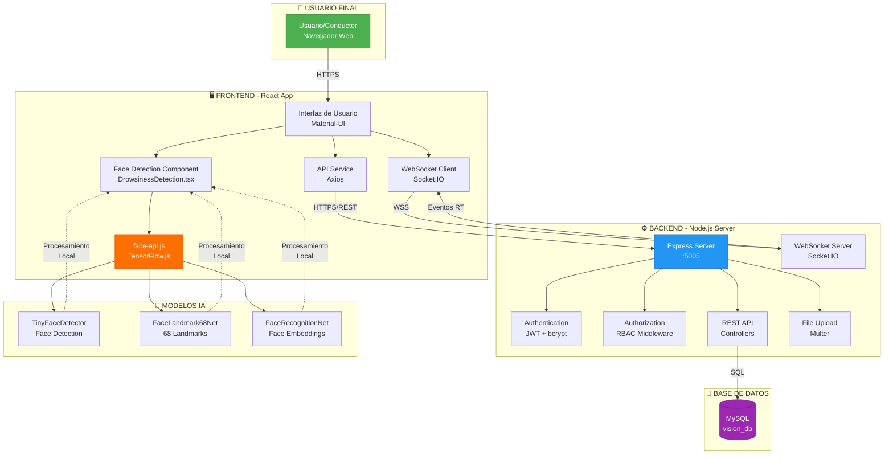
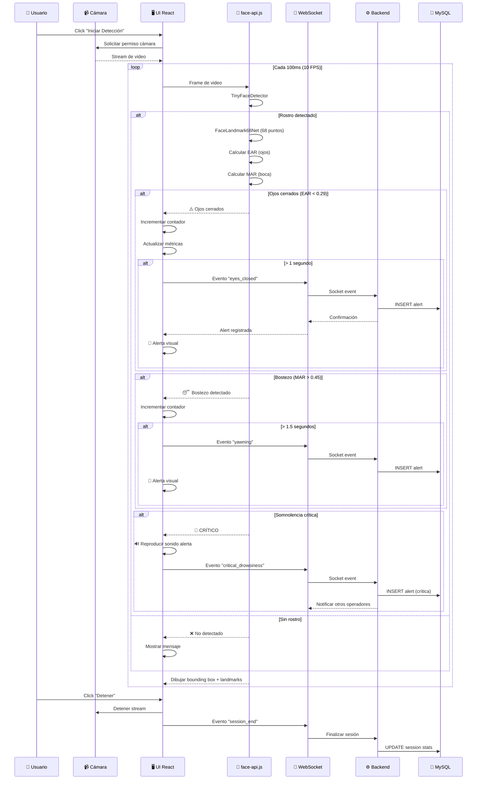
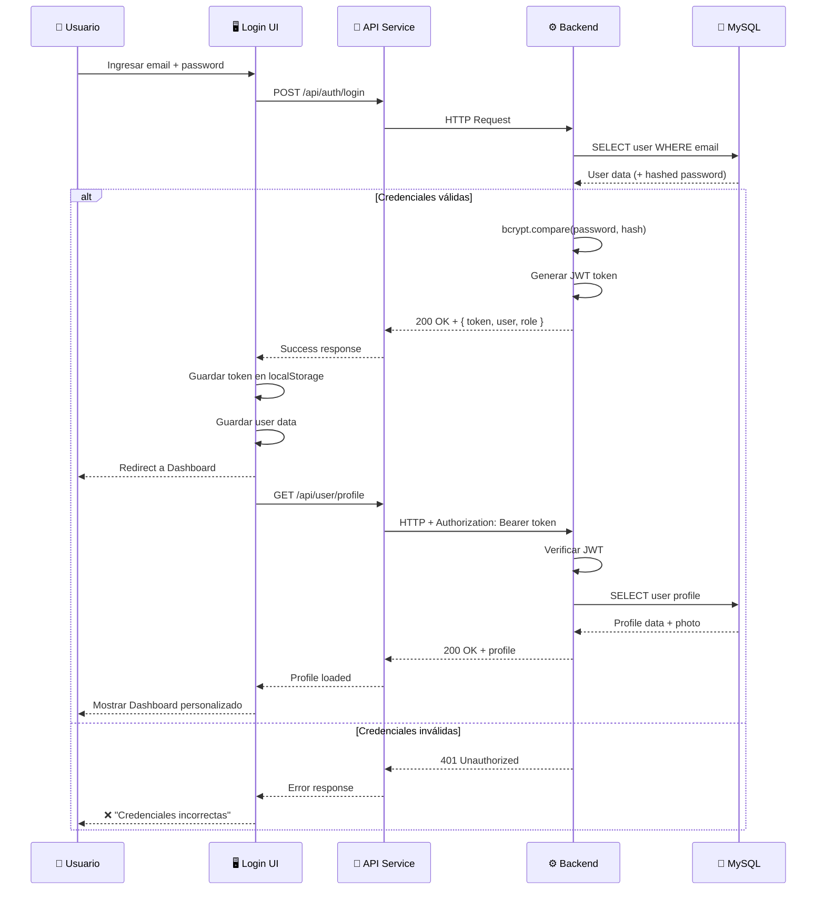
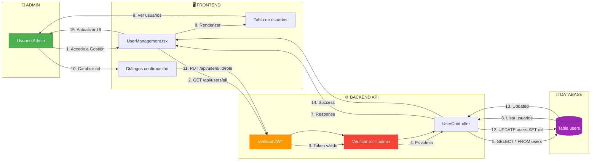
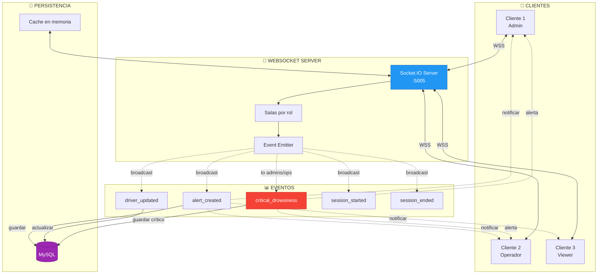
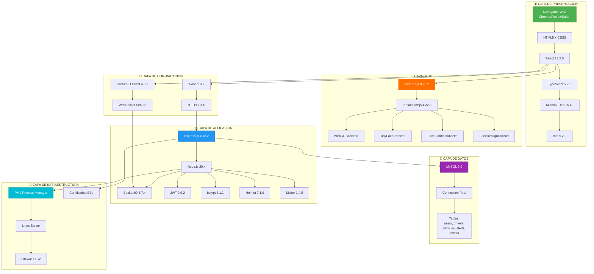
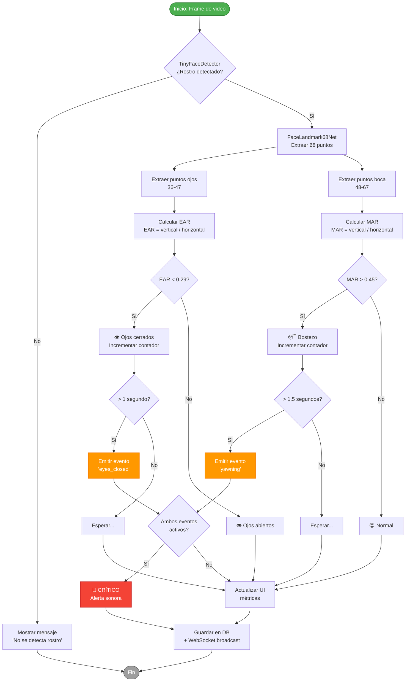

# 🔄 DIAGRAMAS DE FLUJO - SISTEMA VISION

## Comunicación entre Componentes y Usuario Final

---

## 📊 DIAGRAMA 1: Arquitectura General

---

## 📊 DIAGRAMA 2: Flujo de Detección de Somnolencia

---

## 📊 DIAGRAMA 3: Flujo de Autenticación

---

## 📊 DIAGRAMA 4: Flujo de Gestión de Usuarios (Admin)

---

## 📊 DIAGRAMA 5: Comunicación en Tiempo Real (WebSocket)

---

## 📊 DIAGRAMA 6: Stack Tecnológico Completo

---

## 📊 DIAGRAMA 7: Flujo de Datos EAR/MAR

**Autor:** Rogeero Daniel Montufar Merma  
**Proyecto:** VISION - Sistema de Detección de Somnolencia  
**Fecha:** Octubre 2025

